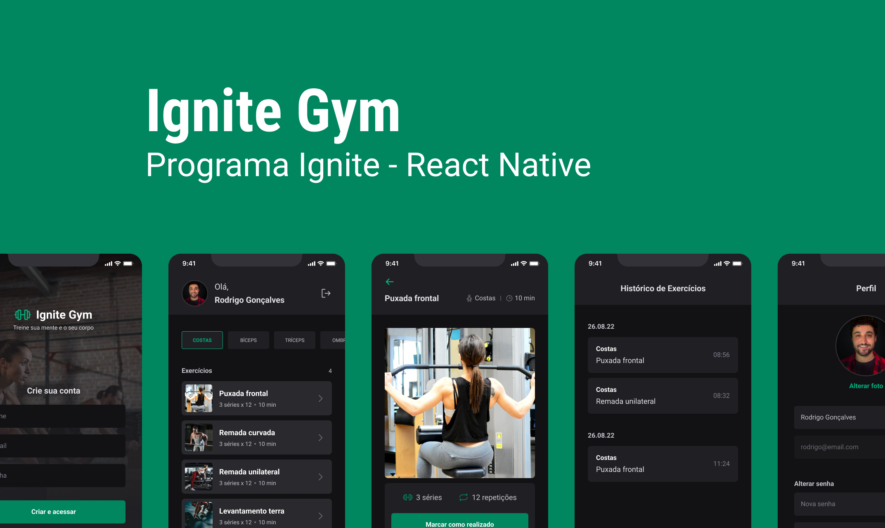

<p align="center">
  
</p>

# Ignite Gym
Projeto desenvolvido na trilha de react native do programa Ignite da Rocketseat.

## Protótipo
<!--  -->

## Bibliotecas utilizadas
- [Babel-plugin-module-resolver](https://www.npmjs.com/package/babel-plugin-module-resolver)
Criação de paths dinâmicos
```bash
  yarn add --dev babel-plugin-module-resolver
```

- [Expo-google-fonts](https://docs.expo.dev/guides/using-custom-fonts/#using-a-google-font)
Utilização da fonte Roboto com expo fonts
```bash
  npx expo install expo-font @expo-google-fonts/roboto
```

- [Native-base](https://docs.nativebase.io/)
Biblioteca de estilização
```bash
  yarn add native-base

  expo install react-native-svg@12.1.1

  expo install react-native-safe-area-context@3.3.2
```

- [React-native-svg-transformer](https://www.npmjs.com/package/react-native-svg-transformer)
Utilização de svg como componente
```bash
  yarn add --dev react-native-svg-transformer
```

- [React-navigation](https://reactnavigation.org/docs/getting-started/)
Criação da navegação da aplicação
```bash
  yarn add @react-navigation/native

  npx expo install react-native-screens react-native-safe-area-context
```

Stack Navigation:
```bash
  yarn add @react-navigation/native-stack
```

Bottom Tab Navigation:
```bash
  yarn add @react-navigation/bottom-tabs
```